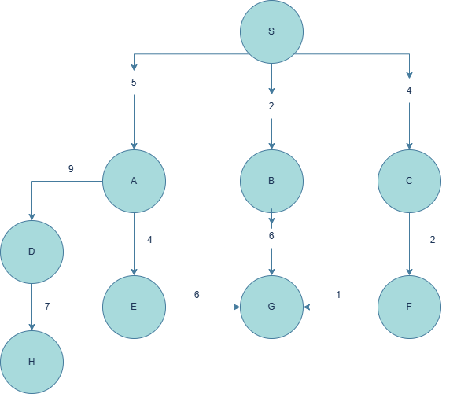

# Best-First Search Algorithm (Python)

This project demonstrates the **Best-First Search algorithm** implemented in Python. It works on a weighted directed graph and finds the optimal path from a starting node to a goal node based on cumulative cost.

## 🧠 What is Best-First Search?

Best-First Search is a pathfinding algorithm that explores a graph by expanding the most promising node according to a specific rule (in this implementation: the lowest path cost so far).

---

## 📌 Features

- Works on **weighted graphs**
- Returns the **optimal path** and **total cost**
- Logs each step of the algorithm for understanding the search process
- Clear and simple implementation in pure Python

---

## 📈 Graph Structure

The graph is defined as an adjacency list (dictionary) like so:

```python
graph = {
    'S': [('A', 5), ('B', 2), ('C', 4)],
    'A': [('D', 9), ('E', 4)],
    'B': [('G', 6)],
    'C': [('F', 2)],
    'D': [('H', 7)],
    'E': [('G', 6)],
    'F': [('G', 1)],
    'G': [],
    'H': []
}
```

---

## ▶️ How to Run

1. Clone the repository:

```bash
git clone https://github.com/youssefkhalifa04/Best-First-Search.git
cd Best-First-Search
```

2. Run the Python file:

```bash
python best_first_search.py
```

Make sure you have Python 3 installed.

---

## ✅ Sample Output

```
=== Best-First Search ===
Initialization:
Open list: [(0, 'S', ['S'])]
Visited nodes: set()

Processed node: S
...

Solution found: S -> B -> G, Total cost: 8

=== Final Result ===
Optimal path: S -> B -> G
Total cost: 8
```

---

## 🖼️ Graph Visualization

Here is the graph used in this project:



---

## 📁 File Structure

```
Best-First-Search/
│
├── best_first_search.py       # Main script containing the algorithm
├── assets/
│   └── graph.png              # Graph diagram used in README
└── README.md                  # Project documentation
```

---

## 📜 License

This project is open-source and available under the [MIT License](LICENSE).

---

## 🤝 Contributing

Pull requests are welcome! For major changes, please open an issue first to discuss what you'd like to change.
```

